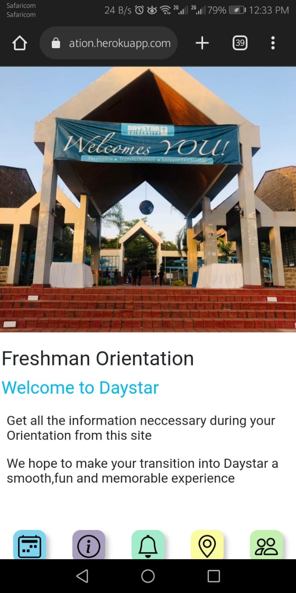
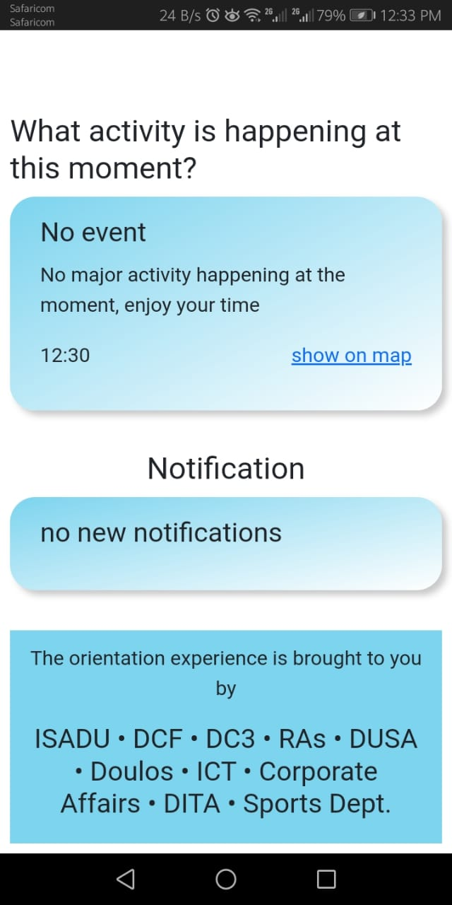
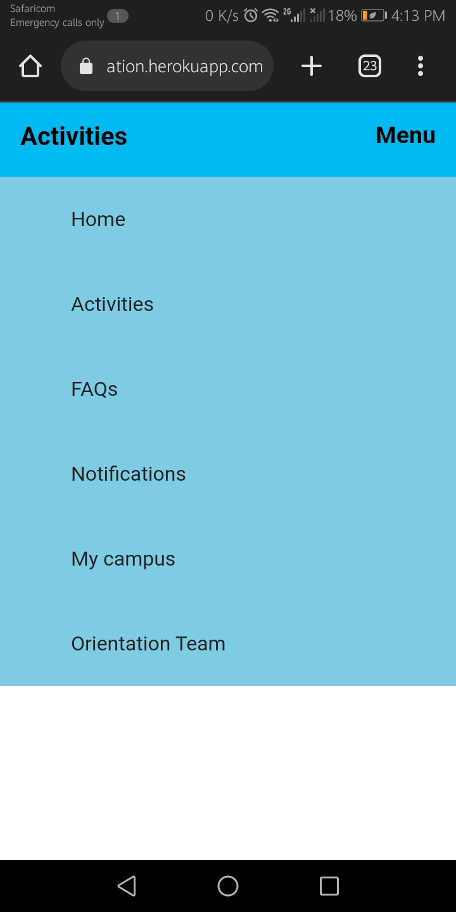
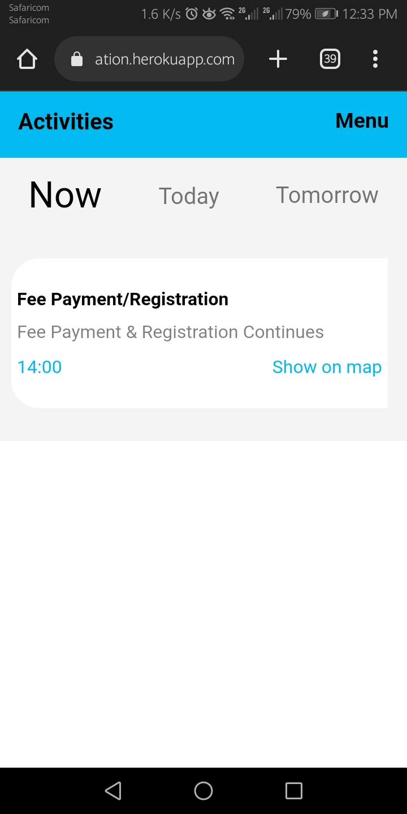
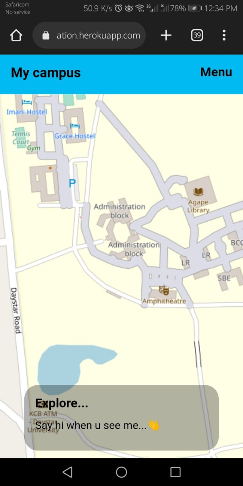
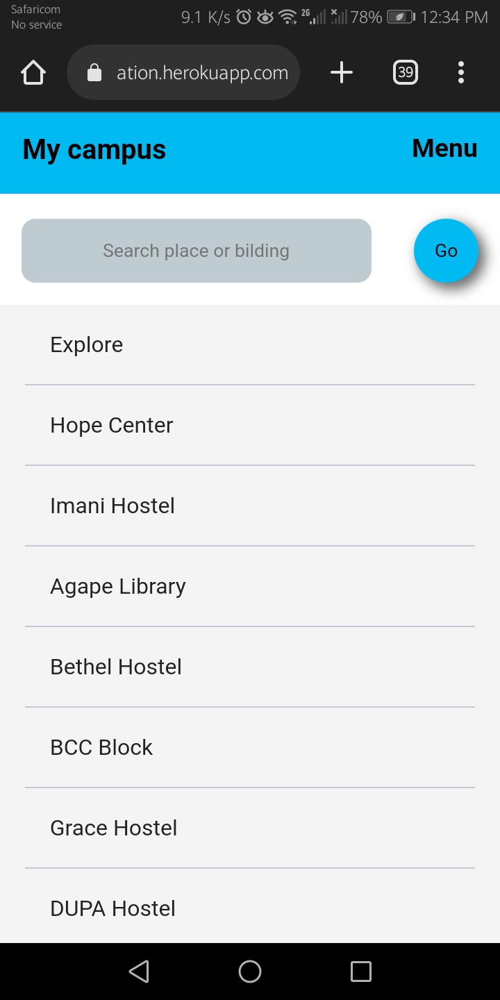
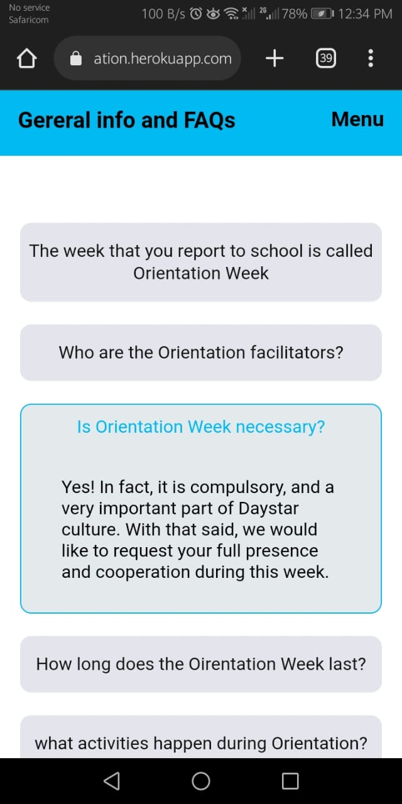

<h1 align="center">Personal school project I created to aid in Daystar Orientation May 2022.</h1>

Case problem: During oreination to my cumpus, DAYSTAR UNI KENYA, their is usually so much information to be communicated to the new parents and students.

Solution: I sort to create an internet based application that servers as a centralised source of communication for both the new students and parents and also the orientation team.

link: https://daystarorientation.herokuapp.com/

**_Featuers integrated_**

1. file handlinig uploading
2. notifications
3. users and login
4. event traking
5. map features
6. geo locaition

This project is privste but the following are pictures of the finished working project

Technologies:
    **_Django,
    Html,
    Css,
    Js,
    AWS &
    Heroku_**

**Screens**

Landing page

Menu Page

Events page

Map Page

Info page

